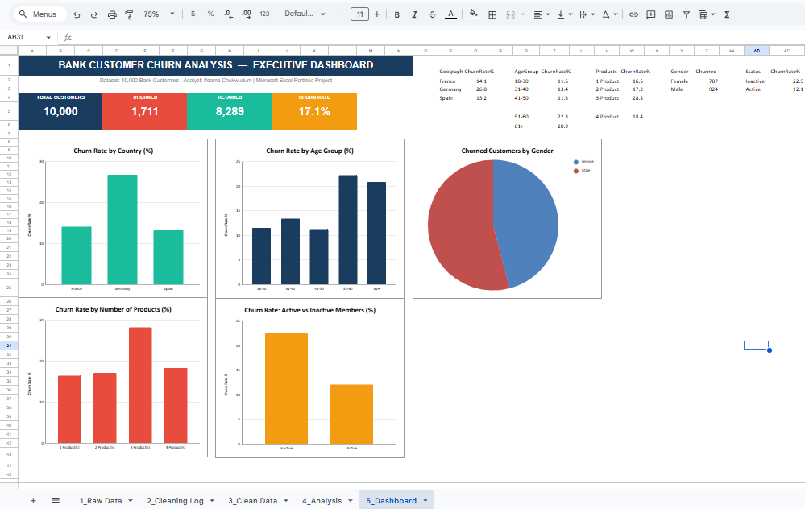

# 🏦 Bank Customer Churn Analysis — Excel Dashboard Project


---

## 📌 Project Overview

This project presents an **end-to-end data analysis** of bank customer churn — from raw, messy data through to a fully interactive executive dashboard — built entirely in Microsoft Excel.

The goal was to identify **which customer segments are most likely to leave the bank**, and to provide **actionable business recommendations** that a real banking team could act on.

> **Analyst:** Ifeoma Chukwudum
> **Tool:** Microsoft Excel
> **Dataset:** 10,000 Bank Customers (synthetic, modelled on real-world churn data)
> **Project Duration:** End-to-end solo project

---

## 🎯 Business Problem

A retail bank is experiencing customer churn. The leadership team needs to understand:

- What percentage of customers are leaving?
- Which customer segments (by country, age, gender, activity) churn the most?
- What products or behaviours are associated with churn?
- What actions should the bank take to retain at-risk customers?

---

## 📂 Workbook Structure

The Excel file is organised into 5 professional sheets:

| Sheet | Description |
|---|---|
| `1_Raw Data` | Original 10,030 records — includes duplicates, invalid values, and inconsistent text |
| `2_Cleaning Log` | Full documentation of every data issue found and the action taken |
| `3_Clean Data` | Final cleaned dataset of 10,000 records, ready for analysis |
| `4_Analysis` | Summary pivot tables — churn by Geography, Gender, Age Group, Products, Active Status |
| `5_Dashboard` | Executive dashboard with 5 charts, 4 KPI cards, and business recommendations |

---

## 🧹 Data Cleaning Steps

All cleaning steps are documented in the `2_Cleaning Log` sheet. Issues identified and resolved:

| # | Issue | Column | Action Taken | Records Fixed |
|---|---|---|---|---|
| 1 | Duplicate rows | All columns | Removed exact duplicates | 30 rows |
| 2 | Invalid CreditScore values (<300, >850, blank) | CreditScore | Replaced with column median | 50 values |
| 3 | Invalid Age values (<18, >100, negative, blank) | Age | Replaced with column median | 40 values |
| 4 | Inconsistent Gender encoding (male, M, FEMALE, F) | Gender | Standardised to Title Case | ~20 values |
| 5 | Inconsistent Geography casing (france, GERMANY) | Geography | Standardised to Title Case | ~20 values |
| 6 | RowNumber out of sequence after row removal | RowNumber | Re-indexed sequentially from 1 | 10,000 rows |

**Final data quality score: 98.3%**

---

## 📊 Key Findings

### 1. 🔴 Germany Has the Highest Churn Rate (26.8%)
Germany's churn rate is nearly **twice** that of France (14.1%) and Spain (13.2%).
**Recommendation:** Launch Germany-specific customer retention campaigns and improve local customer service quality.

### 2. 👴 Older Customers Are Most Likely to Leave
Customers aged **51–60 churn at 22.3%** and **61+ at 20.9%** — significantly above younger segments.
**Recommendation:** Introduce senior loyalty programmes and assign dedicated relationship managers to this age group.

### 3. 📦 Customers with 3–4 Products Show High Churn
Despite holding more products, these customers leave at a disproportionately high rate — suggesting product complexity or unmet expectations.
**Recommendation:** Conduct product experience reviews and simplify multi-product bundles.

### 4. 😴 Inactive Members Are a Flight Risk
Inactive members churn at a significantly higher rate than active members.
**Recommendation:** Implement automated re-engagement campaigns (email, app notifications) triggered by 60+ days of account inactivity.

---

## 📈 Dashboard Preview

> 
The dashboard includes:
- **4 KPI Cards** — Total Customers, Churned, Retained, Churn Rate
- **5 Charts** — Churn by Country, Age Group, Products, Gender (Pie), Active Status
- **4 Business Recommendations** — Written in plain language for non-technical stakeholders

---

## 🛠️ Skills Demonstrated

- ✅ Data cleaning and validation
- ✅ Duplicate detection and removal
- ✅ Data standardisation (text normalisation, type correction)
- ✅ Documentation and cleaning log creation
- ✅ Pivot analysis and segmentation
- ✅ Chart design and dashboard layout in Excel
- ✅ Business insight generation and storytelling
- ✅ Professional workbook presentation

---

## 💼 About the Analyst

**Ifeoma Chukwudum** is a Data Analyst with 15+ years of professional experience spanning financial services (Zenith Bank Plc), market research, and business analytics. She combines strong mathematical foundations (BSc Mathematics, MSc GIS) with hands-on data skills to deliver actionable insights.

🔗 [LinkedIn](https://www.linkedin.com/in/ifeoma-margaret-chukwudum)

---

## 📁 Files in This Repository

```
├── Bank_Churn_Dashboard_Ifeoma.xlsx   # Full Excel workbook (5 sheets)
├── README.md                           # This file
└── dashboard_screenshot.png            # Dashboard preview image (add after screenshotting)
```

---

*This project was completed as part of a personal data analytics portfolio. Dataset is synthetic and modelled on publicly available bank churn datasets.*
